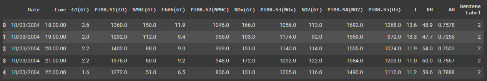
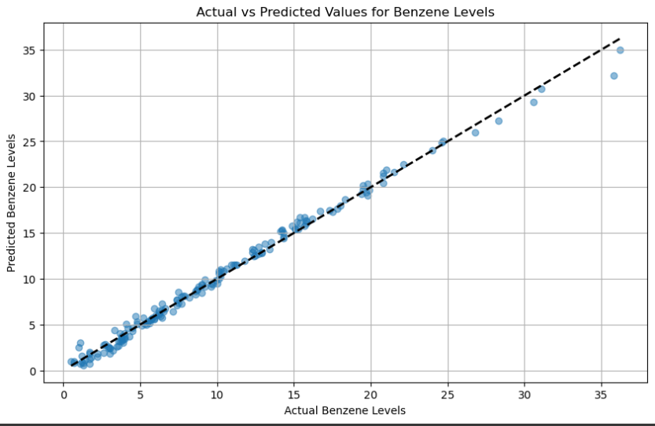
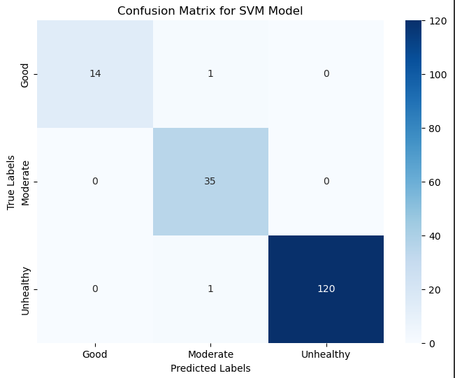
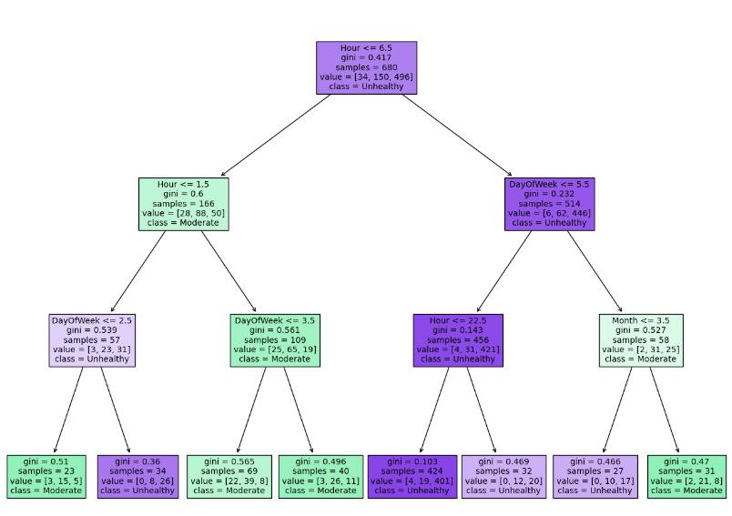

# A.I. for Air Quality: Deciphering Benzene Patterns in Urban Environments through Machine Learning

This project presents an analysis of air quality data to address pressing environmental and public health concerns related to air pollution with a focus on Benzene.  Machine learning techniques, such as linear regressions, support vector machines (SVM), and decision trees, were applied to predict and classify Benzene levels as "Good," "Moderate," or "Unhealthy" based on time-stamped concentrations.  The results revealed distinct temporal patterns in pollution levels, allowing the potential to identify peak pollution times and optimal periods for outdoor activities.  

***

## Introduction 

In the era of rapid urbanization and industrial growth, air quality has emerged as a critical environmental and public health concern. Among the various pollutants that deteriorate air quality, Benzene, a volatile organic compound, stands out due to its significant health implications. Classified as a carcinogen, Benzene is predominantly released from industrial emissions and vehicular exhaust, making its presence in urban atmospheres a subject of grave concern. Elevated levels of Benzene are linked to various health issues, including an increased risk of leukemia and other blood disorders, making the monitoring and analysis of its concentration in urban air extremely important.

To solve this problem, supervised machine learning was employed to investigate the Benzene levels in an air quality dataset centered around a densely populated Italian city.  Linear Regression was used to predict continuous Benzene concentrations,  Support Vector Machines (SVM) were utilized to categorize concentrations into risk levels, and Decision Trees were created to identify peak pollution times and optimal periods for outdoor activities.  These tactics create excellent tactics to monitor Benzene levels thus allowing the minimization of exposure to high concentrations of the dangerous carcinogen and reducing its detrimental long-term health consequences.  

The Linear Regression model successfully predicted Benzene levels, capturing a strong linear relationship between time predictors and the target variable.  It demonstrated high predictive power with low error, making it incredibly reliable.  The SVM was able to accurately predict and categorize pollution levels into "Good," "Moderate," and "Unhealthy" risk groups.  Overall, the model showed high precision and recall, especially for the "Unhealthy" category, which is crucial from a public health perspective.  The Decision Tree provided valuable temporal insight into Benzene level fluctuations.  It reveals certain hours of the day, days of the week, and months were more strongly associated with higher levels of Benzene, which hints at patterns of human activity that are influencing pollution levels such as traffic.  

***

## Data

The dataset at the core of this project, sourced from the UC Irvine Machine Learning Repository, consists of 9358 instances of hourly averaged responses from a multi-sensor air quality monitoring device. These readings were recorded over the span of one year, from March 2004 to February 2005, in a significantly polluted urban area within an Italian city. The data captures a comprehensive range of pollutants, including Carbon Monoxide (CO), Non-Methane Hydrocarbons (NMHC), Nitrogen Oxides (NOx), Nitrogen Dioxide (NO2), and of course, Benzene (C6H6). 


Preprocessing

The first step of the project was to preprocess the dataset. Columns containing no useful information, missing values originally marked as “-200,” rows lacking essential time-related data, and numeric columns incorrectly formatted as “object” types were all removed to ensure data integrity.  Benzene concentration levels, measured in µg/m3, were then categorized into three risk levels based on simplified WHO [1] and EU [2] regulations: Good (1.7), Moderate (>1.7-5), and Unhealthy (>5).  The dataset was split into feature sets (X) and target variables (y). For regression, "y" was the continuous Benzene levels, and for classification, "y" was the categorized risk levels. A standard 80-20 split was used for training and testing datasets to ensure a balanced approach to model training and validation.  The data was then displayed using pandas (Fig.1).



*Fig. 1: Displaying head of preprocessed data via pandas*


Linear Regression

Given the continuous nature of the Benzene concentration values, a regression model was used. Linear Regression, a fundamental yet powerful technique, was chosen for its simplicity and interpretability. This model facilitates understanding the relationship between various sensor readings and Benzene levels. The model was trained on the training set to predict Benzene levels. Its performance was evaluated using metrics like Mean Squared Error (MSE) and R-squared, which indicate the model's accuracy and explanatory power.  It was then visualized using a scatter plot (Fig. 2).



*Fig. 2: Linear Regression of Benzene levels*

The dashed line represents the line of perfect prediction. The data points are clustered close to this line, which implies that the model predictions are quite accurate. The majority of data points are concentrated at the lower end of Benzene levels (between 0 to approximately 10 µg/m³), indicating that lower Benzene levels are more common in the dataset. There are fewer data points at higher Benzene levels, but the model appears to predict these reasonably well, as the points are close to the line of perfect prediction. These data points could indicate times of significant traffic.  Overall, the scatter plot indicates a successful application of Linear Regression to predict Benzene levels, with the model capturing a strong linear relationship between the predictors and the target variable.  The Mean Square Error for the model was approximately 0.401, and the R-squared value was about 0.992. The model has a high predictive power with low error, making it highly reliable for predicting Benzene levels in the dataset.  


Support Vector Machine (SVM)

To categorize Benzene levels into the three risk groups, a support vector machine (SVM) model was implemented.  Using the model, a confusion matrix was generated (Fig. 3).  The x-axis (horizontal) represents the predicted labels by the SVM model. The y-axis (vertical) represents the actual categories.



*Fig. 3: Confusion matrix generated using the SVM*

The model is highly accurate in predicting the "Unhealthy" category, with the highest number of correct predictions. The model also performs well in identifying the "Good" and "Moderate" categories, with a very low number of misclassifications. Overall, the model shows high precision and recall, especially for the "Unhealthy" category, which is critical from a public health perspective. The SVM model demonstrates excellent classification performance with a high degree of accuracy across all three Benzene level categories. The very few misclassifications present a minor concern and could be addressed by further refining the model or feature selection.


Decision Tree

To gain insight into the Benzene level at certain times and dates, a decision tree was created.  Because of the numerous data points within the dataset, the decision tree was altered just to focus on a couple of points to verify its effectiveness (Fig. 4).  



*Fig. 4: Decision tree to identify times of higher pollution*

The tree splits based on features such as "Hour," "DayOfWeek," and "Month," which suggests that time-related features are critical in predicting Benzene levels. For hours less than or equal to 6.5, a further split occurs based on the "DayOfWeek." If "DayOfWeek" is less than 5.5, the classification leans toward "Unhealthy"; otherwise, it considers "Hour" and "Month" for further classification. The tree's leaf nodes provide the final classification. The tree suggests that certain hours of the day, days of the week, and months are more strongly associated with higher levels of Benzene. In summary, the decision tree offers a model that uses time-related features to classify Benzene levels effectively.

## Modelling

Here are some more details about the machine learning approach, and why each was deemed appropriate for the dataset. 

Linear Regression was deemed appropriate because of the continuous nature of the target variable, Benzene.  They are straightforward and easy to interpret, making them a great choice for understanding the direct impact of each predictor on the target variable.  Because of its simplicity, it serves as a wonderful baseline as well.  

```python
from sklearn.model_selection import train_test_split
from sklearn.linear_model import LinearRegression
from sklearn.metrics import mean_squared_error, r2_score
import matplotlib.pyplot as plt
# prepare the data for the regression model
X = air_quality_data.drop(['C6H6(GT)', 'Date', 'Time', 'Benzene_Label'], axis=1)  # Features
y = air_quality_data['C6H6(GT)']  # Target variable
# split the dataset into training and testing sets
X_train, X_test, y_train, y_test = train_test_split(X, y, test_size=0.2, random_state=42)
# train the Linear Regression model
model = LinearRegression()
model.fit(X_train, y_train)
# predict on the test set
y_pred = model.predict(X_test)
mse = mean_squared_error(y_test, y_pred)
r2 = r2_score(y_test, y_pred)
```
SVM was selected for its ability to classify the Benzene levels into discrete categories.  

```python
from sklearn.svm import SVC
from sklearn.metrics import classification_report, confusion_matrix
import seaborn as sns
# prepare the data for the SVM model
X = air_quality_data.drop(['C6H6(GT)', 'Date', 'Time', 'Benzene_Label'], axis=1)
y = air_quality_data['Benzene_Label']
# split the dataset into training and testing sets
X_train, X_test, y_train, y_test = train_test_split(X, y, test_size=0.2, random_state=42)
# train the SVM model
svm_model = SVC(kernel='linear')
svm_model.fit(X_train, y_train)
y_pred = svm_model.predict(X_test)
```

A decision tree was appropriate because it can identify the most important features for classification and help visualize patterns.  

```python
from sklearn.tree import DecisionTreeClassifier
from sklearn import tree
# prepare time-related features
air_quality_data['DateTime'] = pd.to_datetime(air_quality_data['Date'] + ' ' + air_quality_data['Time'], format='%d/%m/%Y %H.%M.%S')
air_quality_data['Hour'] = air_quality_data['DateTime'].dt.hour
air_quality_data['DayOfWeek'] = air_quality_data['DateTime'].dt.dayofweek
air_quality_data['Month'] = air_quality_data['DateTime'].dt.month
# define features and labels for the model
X = air_quality_data[['Hour', 'DayOfWeek', 'Month']]  # using only the extracted time-related features
y = air_quality_data['Benzene_Label']
# split the dataset into training and testing sets
X_train, X_test, y_train, y_test = train_test_split(X, y, test_size=0.2, random_state=42)\
# train the decision Tree model
decision_tree_model = DecisionTreeClassifier(max_depth=3, random_state=42)
decision_tree_model.fit(X_train, y_train)
# plot the decision tree
plt.figure(figsize=(16, 12))
tree.plot_tree(decision_tree_model, filled=True, feature_names=X.columns, class_names=['Good', 'Moderate', 'Unhealthy'], fontsize=10)
plt.show()
```

## Results

The scatter plot of the actual versus predicted Benzene levels by the Linear Regression model reveals a strong positive linear relationship, indicating that the model is effectively predicting Benzene concentrations (Fig.2). The data points are densely clustered near the line of perfect prediction, especially in the lower range of Benzene levels. This suggests that the model is particularly adept at predicting normal to moderately elevated Benzene levels. The few points that deviate from the line represent areas where the model's predictions are less accurate, which could be the focus for model refinement.

The SVM model's confusion matrix shows an impressive classification performance (Fig. 3). The matrix illustrates high accuracy in identifying "Good" (14 out of 15) and "Moderate" (35 out of 36) Benzene levels, indicating the model's strong predictive capabilities in these categories. It demonstrates exceptional performance in predicting "Unhealthy" Benzene levels, with 120 correct predictions out of 121, highlighting the model's reliability in identifying high-risk scenarios. It had minimal misclassifications between "Good" and "Moderate" and only one misclassification from "Moderate" to "Unhealthy," suggesting that the model can distinguish between the categories with high confidence.

The decision tree gives insight into the hierarchical importance of features in predicting Benzene levels. Time-related features, specifically "Hour," "DayOfWeek," and "Month," are the primary splitting criteria, suggesting these are key predictors of Benzene levels. The tree's splits indicate patterns in Benzene levels, with certain times of the day and week being more associated with higher Benzene levels, possibly linked to traffic and industrial activities. 

The results from the Linear Regression and SVM models indicate that the selected features are strong predictors of Benzene levels and can classify the pollution levels with high accuracy. The models' success in predicting and classifying Benzene levels can be leveraged to develop real-time monitoring systems for urban air quality management. The time-related patterns observed can inform targeted interventions during periods when higher pollution levels are predicted. Moreover, the slight misclassifications observed in the SVM model and the outliers in the Linear Regression model offer opportunities for further refinement, such as feature engineering or the inclusion of additional data sources. The decision tree's interpretability provides clear rules for classifying Benzene levels, which can be particularly useful for understanding the decision-making process in non-technical terms. 


## Discussion

Across all models, the time-related features appear to be significant predictors of Benzene levels, suggesting that Benzene concentration fluctuations have a temporal pattern. This could potentially be leveraged to forecast periods of poor air quality, allowing for proactive measures to mitigate exposure, such as issuing health advisories or implementing traffic control measures during predicted high pollution periods.
The findings from these models can inform policy decisions by identifying critical times when interventions may be necessary to protect public health. For instance, if the models consistently identify early morning hours as having "Unhealthy" Benzene levels, policymakers could investigate and address potential sources, such as traffic congestion or industrial activities. Public health officials could also use these predictions to issue warnings to vulnerable populations, such as the elderly or those with respiratory conditions, advising them to minimize outdoor activities during times of predicted high Benzene levels.


## Conclusion

This work has provided valuable insights into the predictive modeling of air quality with a focus on Benzene levels. Through the application of machine learning techniques to a dataset of sensor readings, the following conclusions can be drawn.

The Linear Regression and SVM models have proven to be effective tools for predicting and classifying Benzene levels in urban air. The Linear Regression model accurately predicted Benzene concentrations, particularly at lower levels, and the SVM showed high precision in classifying these levels into "Good," "Moderate," and "Unhealthy" categories. These outcomes underscore the potential of machine learning to contribute meaningfully to environmental monitoring and public health initiatives.

Time-related features such as hour of the day, day of the week, and month were identified as significant predictors of Benzene levels, indicating that pollution levels have discernible temporal patterns. This knowledge can be instrumental for city planners and public health officials in designing interventions to mitigate Benzene exposure, particularly during peak pollution periods.

Future projects could build on this work by incorporating additional environmental variables, such as weather conditions or traffic flow data, to enhance the models' predictive power. Advanced machine learning techniques, including ensemble methods or deep learning architectures, could be explored to handle the complexity of the data better and improve model performance. Additionally, real-time data integration could pave the way for developing dynamic air quality monitoring systems that respond to changing environmental conditions, offering a proactive approach to managing urban air quality.


## References
[1] World Health Organization. (2021, September 22). What are the who air quality guidelines?. World Health Organization. https://www.who.int/news-room/feature-stories/detail/what-are-the-who-air-quality-guidelines 

[2] Air. European Commision. (n.d.). https://environment.ec.europa.eu/topics/air_en 
